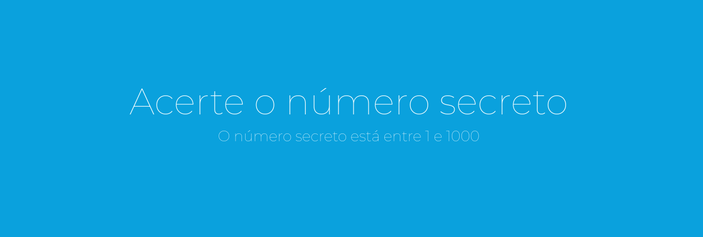

<h1 align="center"> Número Secreto </h1>

  <a href="#-tecnologias">Tecnologias</a>&nbsp;&nbsp;&nbsp;|&nbsp;&nbsp;&nbsp;
  <a href="#-projeto">Projeto</a>&nbsp;&nbsp;&nbsp;&nbsp;&nbsp;&nbsp;

  

## 🚀 Tecnologias

Esse projeto foi desenvolvido com as seguintes tecnologias:

- HTML e CSS
- JavaScript
- Web Speech API
- Git e Github

## 💻 Projeto

Jogo de adivinição.

Adivinhe o número aleatório usando comandos de voz e recebendos feedbacks sobre seu desempenho.

Como jogar:

1 - Acesse o Link
2 - Permita o uso do microfone
3 - Fale um número que qualquer
4 - Use as dicas até acertar

Navegadores suportados: 
- Google Chrome
- Microsoft Edge
- Opera
- Safari

- [Acesse o projeto finalizado, online](https://reconhecimento-de-voz-gold.vercel.app/)
